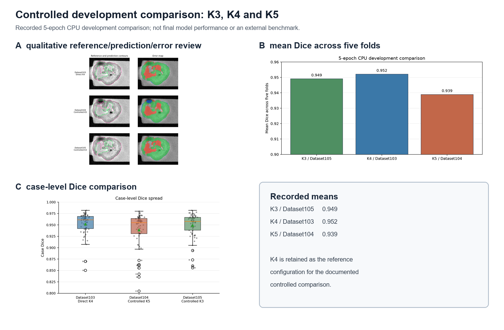
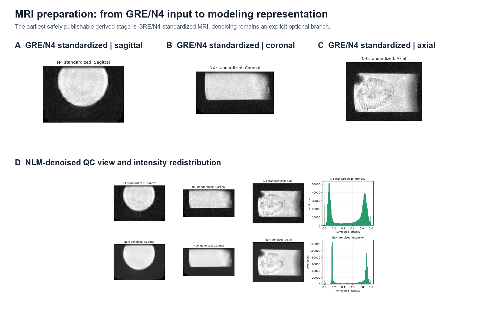
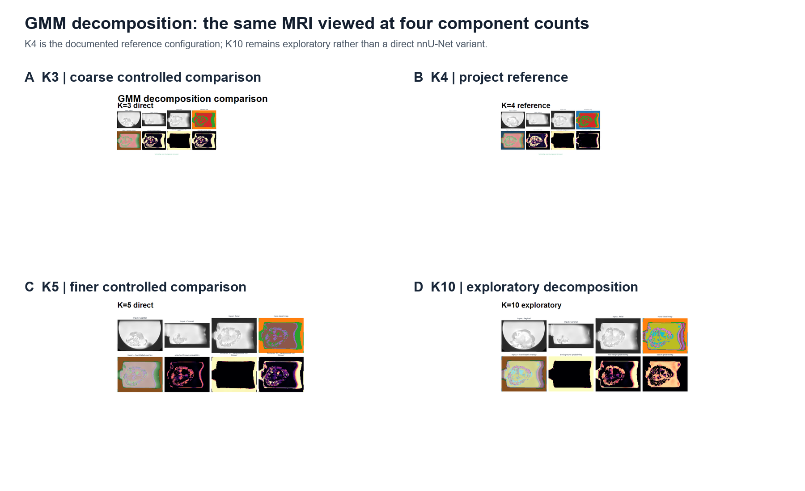
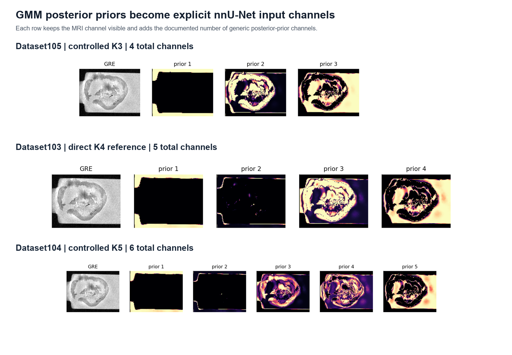

# Organoid MRI Segmentation with GMM Priors and nnU-Net

This repository contains a data-free extraction of an MRI segmentation workflow built around GRE/N4 preparation, GMM-derived probability priors, explicit geometry and label QC, and nnU-Net v2 dataset integration. It presents the engineering path from MRI representation to controlled development evaluation.

[Architecture](docs/architecture.md) · [Workflow](docs/workflow.md) · [GMM experiments](docs/gmm-experiments.md) · [nnU-Net experiments](docs/nnunet-experiments.md) · [Results](docs/results.md) · [Data policy](docs/data-policy.md)

## At a glance

| Area | Implementation |
| --- | --- |
| MRI | MGE/GRE-derived MRI with NIfTI spatial metadata |
| Preprocessing | GRE/N4 input contract, z-score, min-max, optional NLM |
| Probabilistic priors | GMM K3/K4/K5/K10 experiments |
| Segmentation | Binary organoid target with nnU-Net v2 integration helpers |
| Controlled comparison | Direct K4 reference with controlled K3 and K5 branches |
| Evaluation | Five-fold, 5-epoch CPU development comparisons plus qualitative QC |

## Project workflow

~~~mermaid
flowchart LR
    A[MGE or GRE MRI] --> B[GRE/N4 preparation]
    B --> C[Z-score and min-max normalization]
    C --> D{Optional NLM branch}
    D --> E[Support mask]
    E --> F[GMM posterior priors]
    F --> G[Shape, spacing, affine and label QC]
    G --> H[nnU-Net dataset contract]
    H --> I[nnU-Net external planning and training]
    I --> J[Prediction, reference and volume QC]
~~~

The public code keeps pure array computation separate from filesystem integration. Paths are supplied by the caller, and nnU-Net remains an external runtime.

## MRI preparation

The earliest safely publishable derived input is GRE/N4-standardized MRI; the source project also records an optional NLM-denoised branch. The consolidated figure keeps these stages together so the preparation decision is visible before probabilistic modeling.

The implementation is centered in [normalization.py](src/mri_segmentation/preprocessing/normalization.py), [denoise.py](src/mri_segmentation/preprocessing/denoise.py), and [pipeline.py](src/mri_segmentation/preprocessing/pipeline.py).

## GMM probability modeling

The decomposition comparison keeps the experiment roles separate: K3 is coarser, K4 is the direct reference, K5 is a controlled finer comparison, and K10 is exploratory.

See [fit.py](src/mri_segmentation/gmm/fit.py), [support.py](src/mri_segmentation/gmm/support.py), and [GMM experiments](docs/gmm-experiments.md).

## From GMM priors to nnU-Net

Posterior channels become explicit model inputs. The controlled contracts map K3 to Dataset105, direct K4 to Dataset103, and K5 to Dataset104.

The public integration layer is described in [channels.py](src/mri_segmentation/nnunet/channels.py), [dataset.py](src/mri_segmentation/nnunet/dataset.py), and [commands.py](src/mri_segmentation/nnunet/commands.py).

## Controlled development comparison

The documented evaluation numbers are explicitly 5-epoch CPU development comparisons from the recorded project runs. They are not final model performance or an external benchmark.

| Dataset | Stage | GMM strategy | Channels | Training status |
| --- | --- | --- | ---: | --- |
| Dataset101 | Baseline | K10-to-K4 soft priors | 5 | Dataset preparation baseline |
| Dataset102 | Corrected-prior prototype | K10-to-K4 sigma-rule priors | 5 | 5-epoch CPU prototype |
| Dataset103 | Reference comparison | Direct K4 | 5 | 5-epoch CPU prototype |
| Dataset104 | Controlled comparison | K5 | 6 | 5-epoch CPU prototype |
| Dataset105 | Controlled comparison | K3 | 4 | 5-epoch CPU prototype |

Detailed individual QC panels and result plots remain available in [GMM experiments](docs/gmm-experiments.md), [nnU-Net experiments](docs/nnunet-experiments.md), and [Results](docs/results.md); the landing page keeps only the four story figures above.

## Engineering implementation

- [NIfTI I/O](src/mri_segmentation/io/nifti.py) keeps spatial metadata explicit.
- [Preprocessing](src/mri_segmentation/preprocessing/) implements normalization, optional NLM, and pipeline ordering.
- [GMM modeling](src/mri_segmentation/gmm/) stabilizes component ordering and reconstructs posterior volumes.
- [Label inspection](src/mri_segmentation/labels/) keeps label transformations explicit.
- [Geometry checks](src/mri_segmentation/geometry/compatibility.py) reject silent shape or affine mismatches.
- [QC utilities](src/mri_segmentation/qc/) provide array-level overlays and preflight checks.
- [Reporting](src/mri_segmentation/reporting/metrics.py) provides small aggregate metric summaries.
- [nnU-Net integration](src/mri_segmentation/nnunet/) plans K3/K4/K5 channel contracts, dataset metadata, commands, and binary metrics.

## Public demonstration

The CLI demonstrates preprocessing and GMM contracts using an in-memory synthetic volume only:

    python -m venv .venv
    python -m pip install -e .
    python -m mri_segmentation demo --components 4

It does not execute the research pipeline, training, inference, or data export. Validation is performed privately; validation artifacts are intentionally not part of the repository.

## Data and provenance

The public scope, figure policy, aggregate summaries, and limitations are described in [Data policy](docs/data-policy.md). No open-source license is provided.
