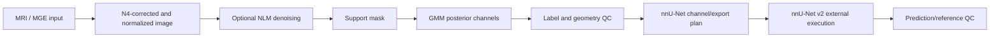
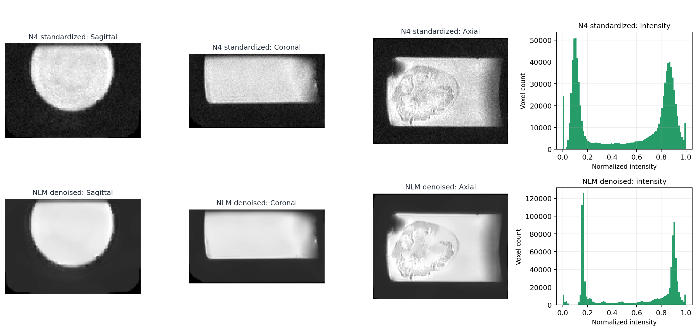
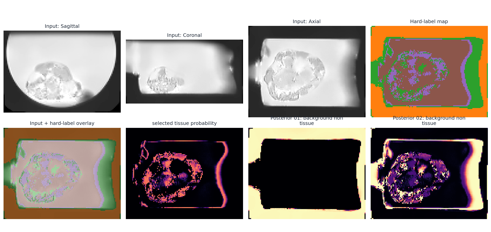
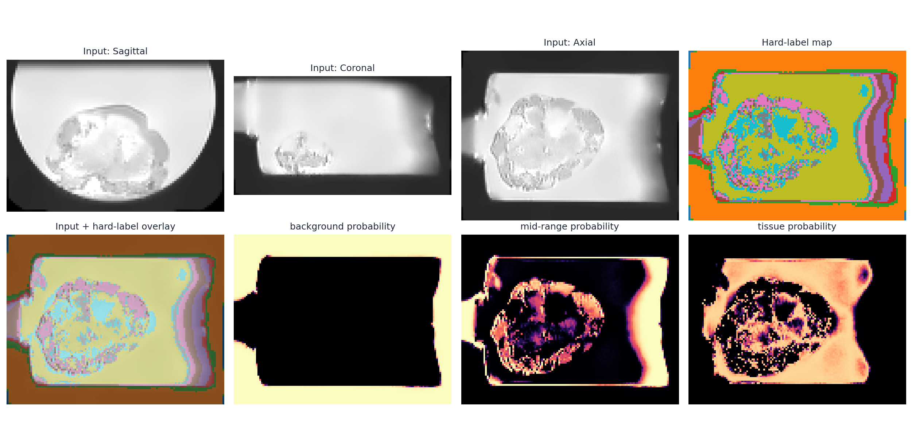

# Organoid MRI Segmentation with nnU-Net

A data-free, engineering-focused implementation of an MRI segmentation workflow for small biological samples. The project connects MRI preparation, GMM-derived probability priors, label and geometry quality control, nnU-Net dataset construction, and prediction review.

No research volumes, masks, model weights, private identifiers, or internal infrastructure are distributed. The three QC panels in `docs/assets/project_qc/` are curated derived figures from one representative project case; case-specific header/footer text has been removed so the panels can illustrate the workflow without exposing project identifiers.

## Workflow



The public implementation focuses on the engineering contracts around the model workflow. nnU-Net itself remains an external dependency; this repository does not copy the nnU-Net framework.

## Curated project evidence

The images below follow the same representative sample through real project QC outputs. They are presentation figures, not a distributed dataset.

### MRI preparation



The panel compares N4-standardized and Non-Local-Means-denoised views and their intensity distributions. The implementation preserves the project order of optional denoising, nonzero z-score normalization, and min-max scaling for downstream modeling.

### GMM probability modeling



The K=5 panel shows multi-view input, hard component labels, an overlay, and posterior-derived maps. Component indices are ordered by mean intensity; biological interpretation is deliberately left to QC and domain review.

### Exploratory finer decomposition



The K=10 panel shows how the same intensity field can be subdivided into more posterior channels. It is an exploratory decomposition, not an automatically validated anatomical labeling.

## What is implemented

- NIfTI loading/saving with explicit spatial metadata.
- Foreground-aware z-score and min-max normalization plus optional 3D Non-Local-Means denoising.
- Support-mask construction, deterministic 1D GMM fitting, stable posterior-channel ordering, probability-volume reconstruction, and hard-label reconstruction.
- Explicit label inspection and caller-selected binary transforms.
- Shape, spacing, origin, direction, and affine compatibility checks without silent resampling.
- nnU-Net v2 dataset case contracts, five-channel export planning, dataset metadata generation, command planning for preprocessing/training/prediction, and prediction/reference QC metrics.
- A small in-memory CLI demo that exercises the preprocessing and GMM path without research data.

## nnU-Net integration

The `mri_segmentation.nnunet` package represents the project-specific integration layer around nnU-Net v2:

- `channels.py` defines the documented normalized-MRI plus GMM-prior channel contract.
- `dataset.py` plans `imagesTr/` and `labelsTr/` names and creates `dataset.json` metadata without copying files.
- `commands.py` builds reviewable `nnUNetv2_plan_and_preprocess`, `nnUNetv2_train`, and `nnUNetv2_predict` commands.
- `qc.py` provides binary prediction/reference metrics used by the project’s result-review workflow.

These helpers intentionally do not execute training or inference and do not include private dataset IDs, server paths, or research files.

## Repository layout

```text
configs/                  Data-free example configuration
src/mri_segmentation/     Reusable implementation
  data/                   Caller-scoped discovery and inventory
  geometry/               Image/mask compatibility checks
  gmm/                    Support masks, fitting, posteriors, volumes
  io/                     NIfTI helpers
  labels/                 Label inspection and explicit transforms
  nnunet/                 Dataset/channel/command/QC integration
  preprocessing/          Normalization, denoising, pipeline order
  qc/                     Array-level overlays and preflight checks
docs/                     Architecture, workflow, data policy, curated QC
```

## Quick start

```bash
python -m venv .venv
python -m pip install -e .
python -m mri_segmentation demo --components 4
```

The demo creates a synthetic volume in memory and prints a compact JSON summary. It does not read or write MRI data.

## Scope and limitations

This repository is the reusable engineering layer around the research workflow, not a reproduction of the private study. It does not distribute raw or derived MRI data, manual masks, trained weights, training logs, private reports, or performance claims. N4 correction is treated as an upstream image-preparation step; the public code does not bundle a full bias-correction runtime. The nnU-Net framework, planning, training, and inference remain external runtime operations driven by reviewed commands.

The package does not infer biological meaning from GMM component numbers. A project-specific mapping must be justified by the corresponding QC and scientific review.

## License and provenance

No license is declared yet. Publication rights and third-party notices must be confirmed before the repository is made public.
