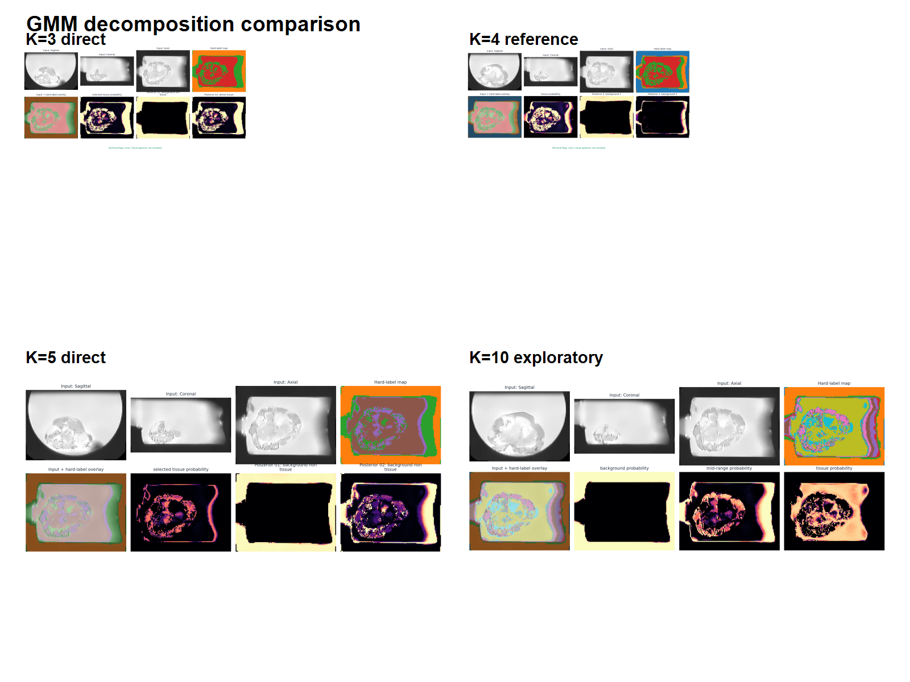

# GMM Experiments

The GMM stage converts the normalized MRI intensity distribution into ordered posterior channels. It is one-dimensional: each supported voxel contributes one scalar intensity, and posterior vectors are reconstructed into the original volume geometry.

| Configuration | Role | Interpretation |
| --- | --- | --- |
| K=3 | Controlled comparison | Coarser subdivision of the intensity field. |
| K=4 | Direct reference | Main direct decomposition used by Dataset103. |
| K=5 | Controlled comparison | Finer controlled subdivision used by Dataset104. |
| K=10 | Exploratory | Fine-grained intensity analysis; no direct nnU-Net dataset is claimed. |

Components are sorted by ascending fitted mean and the same order is applied to means, standard deviations, weights, posterior columns, and hard labels. This prevents component-index permutations from changing the channel contract.

These maps represent intensity populations, not automatically named anatomical classes. Biological interpretation requires QC and target-definition review.

The implementation is in [fit.py](../src/mri_segmentation/gmm/fit.py), [support.py](../src/mri_segmentation/gmm/support.py), [posterior.py](../src/mri_segmentation/gmm/posterior.py), and [volumes.py](../src/mri_segmentation/gmm/volumes.py). The public functions are fit_intensity_gmm, build_support_mask, validate_posteriors, reconstruct_probability_volume, and reconstruct_hard_labels.

## Public implementation fidelity

The public `fit_intensity_gmm()` helper is a generalized reusable implementation of the baseline mechanics: deterministic sampling, scikit-learn GaussianMixture fitting, stable ascending-mean component ordering, and consistent reordering of means, statistics, posterior channels, and hard labels.

The recorded private K3/K4/K5 experiments used reviewed controlled initialization and configuration details preserved in the private project for scientific provenance. This repository does not claim to reproduce those controlled research runs byte-for-byte. It publishes the reusable mechanics and documented channel contracts while keeping private orchestration and provenance material out of the public tree.

K10 remains separate from the controlled nnU-Net comparison because it was used for exploratory decomposition rather than a documented trained dataset.
