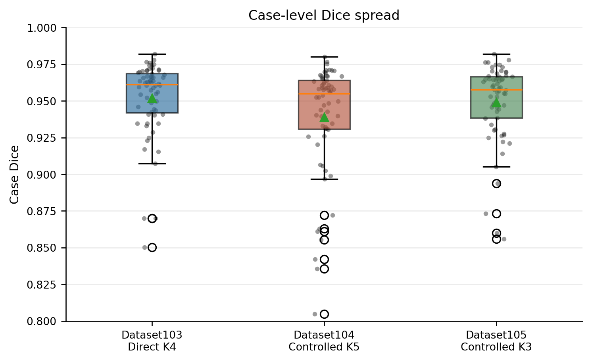
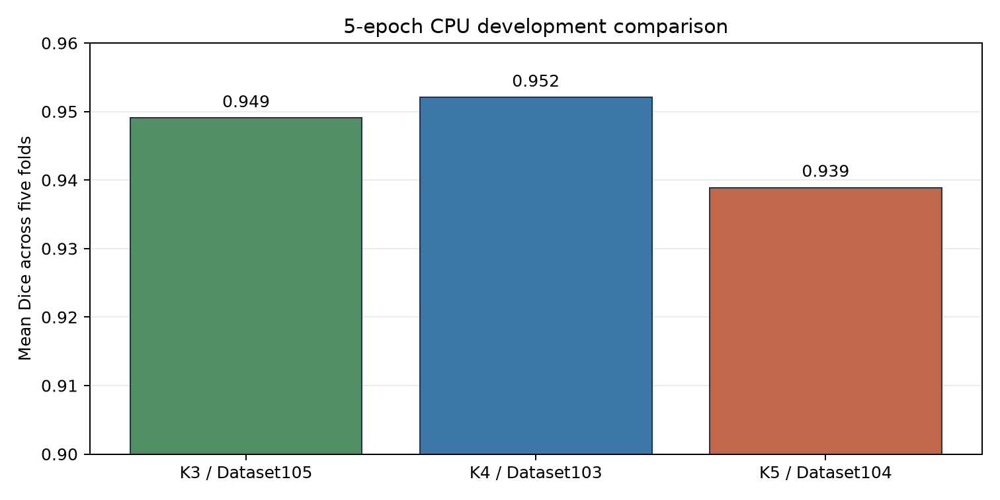
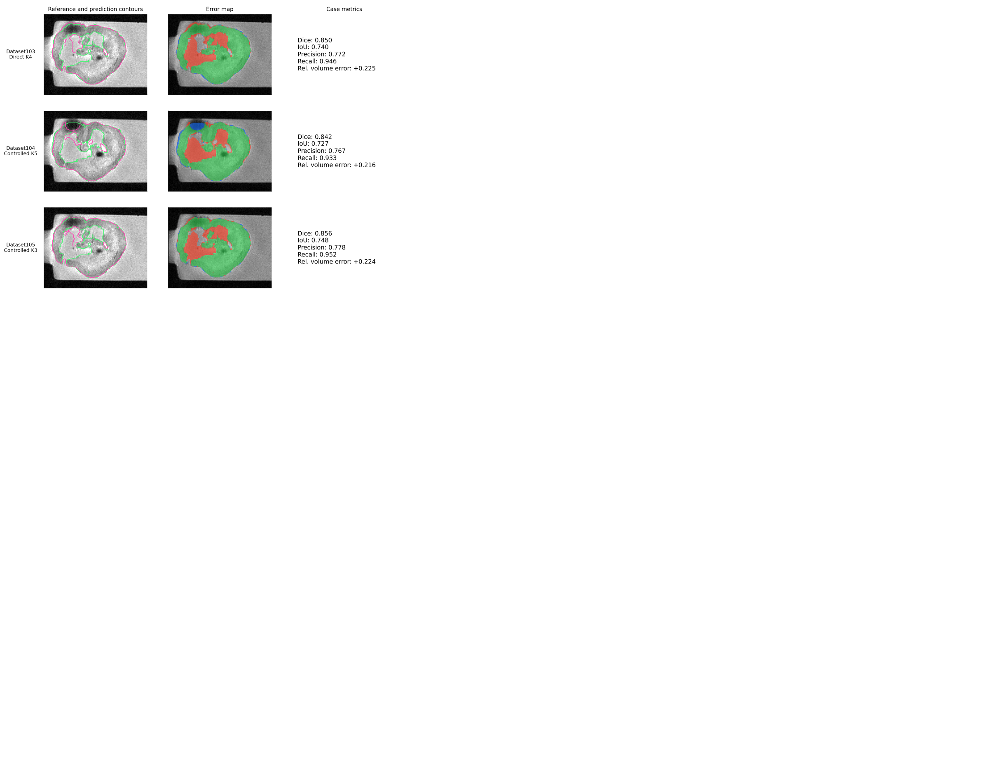
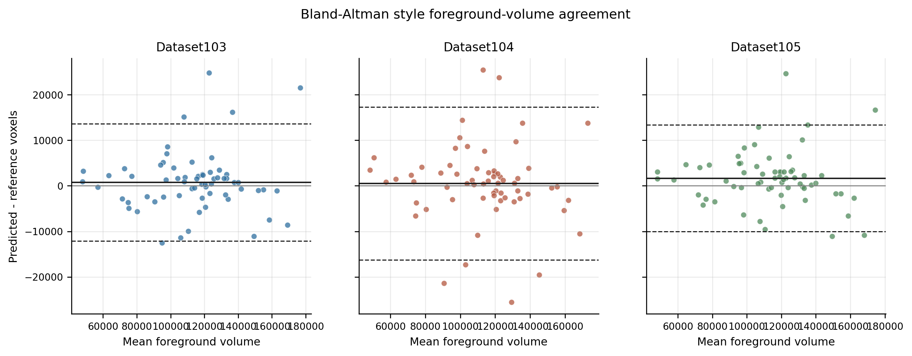
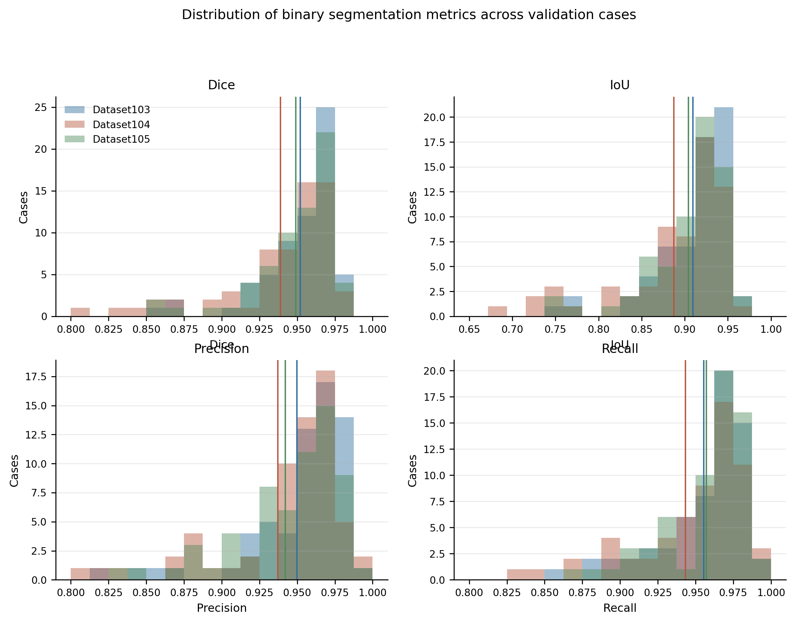

# Results

## Scope and authority

The values below are transcribed from recorded project evaluation summaries. The current result trees are all nnUNetTrainer_5epochs__nnUNetPlans__3d_fullres, so these are 5-epoch CPU development comparisons. No later full-training result tree was identified for Dataset101-105.

## Controlled comparison

| Dataset | Variant | Trainer/run status | Folds | Cases | Channels | Mean Dice | Median Dice | Min–max Dice | Empty predictions | Dice < 0.8 |
| --- | --- | --- | ---: | ---: | ---: | ---: | ---: | ---: | ---: | ---: |
| Dataset103 | Direct K4 | 5-epoch CPU prototype | 5 | 64 | 5 | 0.952008 | 0.961213 | 0.850298–0.981930 | 0 | 0 |
| Dataset104 | Controlled K5 | 5-epoch CPU prototype | 5 | 64 | 6 | 0.938955 | 0.954818 | 0.804697–0.980014 | 0 | 0 |
| Dataset105 | Controlled K3 | 5-epoch CPU prototype | 5 | 64 | 4 | 0.949086 | 0.957588 | 0.855819–0.981868 | 0 | 0 |

The machine-readable table is [nnunet_variant_summary.csv](results/nnunet_variant_summary.csv).

## Dataset102 prototype context

The recorded Dataset102 sigma-rule prototype was a 64-case, five-fold, 5-epoch CPU run. Its mean Dice was 0.836541 and median Dice was 0.952301. Five predictions were empty, nine cases had Dice below 0.5, and nine were below 0.8. The recorded verdict was pass with warnings and review required.

This is useful engineering evidence: the prior branch and QC process were revised before the direct-K4 and controlled K3/K5 comparisons. The Dataset102 aggregate is kept separately in [dataset102_prototype_summary.csv](results/dataset102_prototype_summary.csv).

## Qualitative and volume QC

The overlay panel shows why overlap metrics should be read with spatial review. The selected figure is de-identified and contains no case identifier.

## Limitations

These values summarize recorded project-internal development runs. They are not clinical performance, production accuracy, or an external benchmark. The public repository does not include the underlying images, masks, predictions, folds, or logs, so the tables document recorded evidence rather than a rerunnable result package. K10 is exploratory and is not included as a direct nnU-Net performance result.

